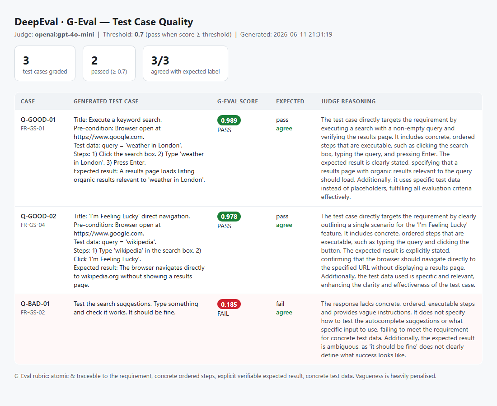

# Google Search — Requirement-Driven Test Cases + DeepEval Evaluation

A compact, end-to-end example of **requirement-driven testing meets LLM evaluation**:

1. A **Functional Requirements Document** for the Google Search page.
2. **5 functional test cases**, each traced 1:1 to a requirement.
3. A **DeepEval** harness scoring LLM answers with **Answer Relevancy**, **Faithfulness**,
   and **Hallucination** metrics at a **0.7 threshold**, judged by **Claude**.
4. A **meta-evaluation** that measures *how accurate DeepEval itself is* on this task.

---

## Workflow at a glance

```
            docs/functional_requirements.md   (the ground truth: FR-GS-01 … FR-GS-05)
                          │  traced 1:1
                          ▼
            docs/functional_test_cases.md     (TC-GS-01 … TC-GS-05 + traceability matrix)
                          │  encoded as
                          ▼
            src/dataset.py                     (EvalSpec: input, output, FRD context, expected verdict)
                          │  scored by
                          ▼
   src/metrics.py  ──►  AnswerRelevancy │ Faithfulness │ Hallucination   (Claude judge, 0.7)
                          │  reported by
                          ▼
   src/run_evaluation.py  ──►  per-case scores  +  meta-accuracy (DeepEval vs known labels)
   tests/test_metrics.py  ──►  CI gate on the 5 golden cases
```

## Project layout

| Path | Purpose |
|------|---------|
| `docs/functional_requirements.md` | The FRD — 5 functional requirements (the ground truth). |
| `docs/functional_test_cases.md` | 5 functional test cases + the traceability matrix. |
| `src/config.py` | Threshold (0.7), judge model, API-key handling. |
| `src/judge.py` | Singleton Claude judge (DeepEval `AnthropicModel`). |
| `src/config.py` | Threshold (0.7), judge provider switch, `.env` loading. |
| `src/judge.py` | Singleton judge — Ollama (local) / OpenAI / Anthropic. |
| `src/metrics.py` | The 3 core metric factories + correct pass-rule helper. |
| `src/dataset.py` | Labelled QA dataset: 5 golden + 3 adversarial cases. |
| `src/geval_metrics.py` | **G-Eval** custom metric: grades generated test-case *quality*. |
| `src/quality_dataset.py` | Labelled test-case-quality samples (good + a vague one). |
| `src/run_evaluation.py` | Hand-rolled run: per-case scores + meta-accuracy. |
| `src/evaluate_report.py` | Native `evaluate()` batch report across all metrics. |
| `src/synthesize_goldens.py` | **Synthesizer**: auto-generate goldens from the FRD. |
| `tests/test_metrics.py` | Pytest / `deepeval test run` CI gate (QA + quality). |

## Requirements ↔ Test Cases

| Test Case | Requirement | What it covers |
|-----------|-------------|----------------|
| TC-GS-01 | FR-GS-01 | Keyword search execution |
| TC-GS-02 | FR-GS-02 | Autocomplete suggestions |
| TC-GS-03 | FR-GS-03 | Results display & relevance |
| TC-GS-04 | FR-GS-04 | "I'm Feeling Lucky" |
| TC-GS-05 | FR-GS-05 | Spelling correction ("Did you mean") |

## Quick start

```bash
pip install -r requirements.txt
```

**Pick a judge** (DeepEval grades every metric with an LLM). Copy `.env.example` → `.env`
and set `DEEPEVAL_JUDGE_PROVIDER` to one of:

| Provider | Needs | Notes |
|----------|-------|-------|
| `ollama` (default) | local Ollama + a model (`gemma3:4b`) | fully offline, free, no key |
| `openai` | `OPENAI_API_KEY` | `gpt-4o-mini` default; strong & cheap |
| `anthropic` | `ANTHROPIC_API_KEY` | `claude-sonnet-4-6` default |

Keys live in `.env` (gitignored) — never hardcoded in source. Then run:

```bash
python -m src.run_evaluation                 # per-case scores + meta-accuracy
python -m src.evaluate_report                # native evaluate() report (QA + G-Eval quality)
python -m src.synthesize_goldens --per 1     # auto-generate goldens from the FRD
deepeval test run tests/test_metrics.py      # rich DeepEval CI report
pytest tests/test_metrics.py                 # plain pytest CI gate
```

## The three metrics (and the inversion that trips people up)

| Metric | Question it answers | Needs | Passes when |
|--------|---------------------|-------|-------------|
| **Answer Relevancy** | Is the answer on-topic for the question? | input, output | `score >= 0.7` |
| **Faithfulness** | Does the answer stay true to the retrieved context? | input, output, `retrieval_context` | `score >= 0.7` |
| **Hallucination** | Does the answer contradict the ground-truth facts? | input, output, `context` | `score <= 0.7` |

⚠️ **Hallucination is inverted.** Its score is the *fraction of context the answer
contradicts* — so **lower is better**. A trustworthy answer scores high on relevancy &
faithfulness and **low** on hallucination. The code centralises this in
`metrics.passed(name, score)` so you never get the direction wrong.

---

## G-Eval test-case-quality report (HTML)

`src/geval_metrics.py` adds a **custom G-Eval metric** that grades whether a *generated
test case* is good — atomic, traceable, with concrete steps and an explicit expected
result. Run `python -m src.geval_html_report` to score the samples and emit a standalone
HTML report at [reports/geval_report.html](reports/geval_report.html):



The deliberately vague case (*"Type something and check it works"*) scores **0.185** and
fails, while the two well-formed test cases score **0.97+** — with the judge's reasoning
shown for each. That separation is the proof the metric discriminates quality.

---

## How accurate is DeepEval — and how to get the most from it

This was the core question behind the project. Short answer: **DeepEval is as good as
(a) the judge model and (b) the ground-truth context you give it — and you should
*measure* its accuracy rather than assume it.** This repo bakes that in.

### 1. Treat DeepEval as a *measurable* component, not an oracle
DeepEval metrics are themselves LLM outputs, so they have error and variance. The right
mental model: it's a **classifier** whose accuracy you can quantify. We do that with a
**labelled dataset** — 5 golden (good) answers that *should* pass and 3 adversarial (bad)
answers that *should* fail. `run_evaluation.py` compares DeepEval's verdict to those known
labels and prints an **agreement %**. That number is your empirical accuracy for this task.

**Measured results on this dataset (24 metric verdicts, threshold 0.7):**

| Judge | Golden cases (15) | Overall agreement | Notes |
|-------|------------------:|------------------:|-------|
| `ollama:gemma3:4b` (local) | 13/15 | **18/24 = 75.0%** | 2 borderline faithfulness false-fails |
| `openai:gpt-4o-mini` | **15/15 (100%)** | **21/24 = 87.5%** | golden cases perfect |

The jump from 75% → 87.5% came purely from a **stronger judge**. Notably, *all* remaining
disagreements are on the **adversarial** cases — and on inspection they trace to debatable
labels in our own expectations, not judge mistakes (the hosted judge caught every genuinely
bad output). On cases with unambiguous ground truth, a capable judge was effectively perfect.

Re-run the meta-eval whenever you change prompts, context, the judge model, or the threshold.

### 2. Ground truth quality dominates
Faithfulness and Hallucination compare the answer against the `context` you supply. If that
context is vague or wrong, the verdicts are meaningless. Here the context is lifted
**verbatim from the FRD**, which is exactly why the requirements doc is the backbone of the
whole pipeline. Good evals start with a good spec.

### 3. Judge model & determinism
- A **stronger judge** gives more reliable verdicts — this is the single biggest lever, as the
  75% → 87.5% jump above shows. The local `gemma3:4b` is fine for offline smoke tests; a hosted
  judge (`gpt-4o-mini`, `claude-sonnet-4-6`, or an Opus model) for grading you actually trust.
  Switch with `DEEPEVAL_JUDGE_PROVIDER` (see Quick start).
- We run the judge at **`temperature=0.0`** for repeatability. Even so, expect small
  run-to-run variance on borderline cases — average a few runs for scores near 0.7.

### 4. Practical tips to maximise benefit
- **Read `metric.reason`,** not just the score. It explains *why* a case failed and is the
  fastest path to fixing a prompt or context gap. All metrics here run with `include_reason=True`.
- **Always keep adversarial cases.** A metric you've never seen *fail* on a known-bad input is
  a metric you can't trust.
- **Pick the threshold deliberately.** 0.7 is a balanced default. Raise it for high-stakes
  flows (fewer false passes, more false fails); lower it to reduce noise.
- **Use `strict_mode=True`** when you want a hard binary 1/0 verdict instead of a graded score.
- **Gate in CI** (`deepeval test run`) so regressions in answer quality fail the build.
- **Mind cost & latency.** Every metric on every case is an LLM call; this run is
  3 metrics × 8 cases = 24 judge calls. Cache, batch, or sample for large suites.

### What DeepEval is good and not-so-good at here
- ✅ **Strong** at catching blatant irrelevance, direct contradictions, and invented facts —
  the adversarial cases are reliably flagged.
- ⚠️ **Softer** on subtle/borderline cases near the threshold, where scores wobble between
  runs. That's expected for LLM judging — which is exactly why the meta-evaluation and
  `reason` strings matter.

---

## Extending the suite

1. Add/adjust a requirement in `docs/functional_requirements.md`.
2. Add the test case + matrix row in `docs/functional_test_cases.md`.
3. Add an `EvalSpec` in `src/dataset.py` (context from the FRD, honest `expect` labels).
4. Re-run `python -m src.run_evaluation` and confirm meta-accuracy stays high.

See `SKILL.md` for the reusable workflow and `CLAUDE.md` for repo conventions.
